<div align="center">


<a href="https://github.com/blacksibainu">
  
</a>

<br/><br/>


</div>

---

## About Me


```javascript
const blacksibainu = {
  location   : "Almaty, Kazakhstan",
  role       : "Full-Stack / Bot / Plugin Developer",
  status     : "Student + Freelancer",
  experience : "8+ years self-taught",
  languages  : ["Kazakh", "Russian", "English"],

  domains: [
    "Web Development",       "Mobile Apps",
    "Desktop Apps",          "Game Development",
    "Cybersecurity",         "Telegram Bots",
    "Minecraft Plugins",     "Automation/Parsing",
    "MMO/RPG Systems",       "AI Tools",
  ],

  philosophy : "If it's worth doing — do it right",
  funFact    : "Reverse-engineers APIs for breakfast",
};
```

<br clear="right"/>

---

## Skills & Proficiency

<div align="center">

</div>

---

## Tech Stack

<div align="center">

**Languages**


**Frameworks & Runtimes**


**Databases & Cloud**


**Tools & IDEs**


**Cybersecurity**


</div>

---

## Featured Projects

<div align="center">
<table>

<tr>
<td width="50%" valign="top">

### [DAMU-AI](https://github.com/blacksibainu/DAMU-AI)
AI-powered project — intelligent automation and tooling.


</td>
<td width="50%" valign="top">

### [CLOverHUB](https://github.com/blacksibainu/CLOverHUB)
Hub platform bringing tools and services together in one place.


</td>
</tr>

<tr>
<td width="50%" valign="top">

### [Universal](https://github.com/blacksibainu/Universal)
Universal multi-purpose tool & bot platform.


</td>
<td width="50%" valign="top">

### [UTM-Lang](https://github.com/blacksibainu/UTM-Lang)
Language & UTM processing project.


</td>
</tr>

<tr>
<td width="50%" valign="top">

### Chess Trainer (Stockfish)
Electron desktop app — top-20 move analysis, anti-bot mode, position editor, ELO control, PGN save/load, opening book.


</td>
<td width="50%" valign="top">

### Anime Stream Bot
Telegram bot — inline keyboard, voice/season/episode/quality select, HLS download via ffmpeg, sends mp4.


</td>
</tr>

<tr>
<td width="50%" valign="top">

### Instagram Downloader (Instander)
Electron desktop app injecting a download button into Instagram web UI. Supports Posts, Reels, Highlights.


</td>
<td width="50%" valign="top">

### Kwork Parser Bot
Telegram bot monitoring Kwork for new freelance projects matching keywords — instant notifications with apply links.


</td>
</tr>

<tr>
<td width="50%" valign="top">

### MC EcoTrade — Minecraft Plugin
Full economy & trading system for Minecraft servers. Player shops, market board, currency, transaction history, taxes.


</td>
<td width="50%" valign="top">

### MC MineKeys — Minecraft Plugin
Mine crates with custom loot tables, key system for locked doors, chest locks, player-bound items and permissions.


</td>
</tr>

<tr>
<td width="50%" valign="top">

### MC RPG Suite — Minecraft Plugin
Full MMO-RPG plugin suite — custom abilities, classes, skill trees, stats, custom mobs, NPC villagers with dialogue and quests.


</td>
<td width="50%" valign="top">

### MC CustomItems — Minecraft Plugin
Custom item framework with unique attributes, lore, recipes, armor stands display and per-player cooldowns.


</td>
</tr>

</table>
</div>

---

## GitHub Stats

<div align="center">


</div>

<div align="center">

</div>

---

## Connect

<div align="center">

[](https://t.me/blacksibainu)
[](https://github.com/blacksibainu)

</div>

---


<div align="center">
  
</div>
