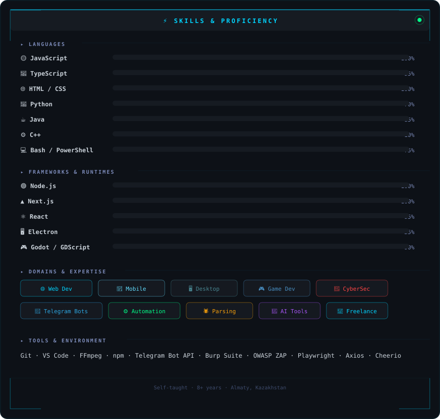

<div align="center">


<br/><br/>


</div>

---

## About Me

```javascript
const blacksibainu = {
  location   : "Almaty, Kazakhstan",
  role       : "Developer",
  status     : "Student + Freelancer",
  experience : "4+ years self-taught",
  languages  : ["Kazakh", "Russian", "English"],

  domains: [
    "Web Development",       "Mobile Apps",
    "Desktop Apps",          "Game Development",
    "Cybersecurity",         "Telegram Bots",
    "Minecraft Plugins",     "Automation/Parsing",
    "MMO/RPG Systems",       "AI Tools",
  ]
};
```

<br clear="right"/>

---

## Skills & Proficiency

<div align="center">

</div>

---

## Tech Stack

<div align="center">

**Languages**


**Frameworks & Runtimes**


**Databases & Cloud**


**Tools & IDEs**


**Cybersecurity**


</div>

---

## GitHub Stats

<div align="center">


</div>

<div align="center">

</div>

---

## Connect

<div align="center">

[](https://t.me/blacksibainu)
[](https://github.com/blacksibainu)

</div>

---


<div align="center">
  
</div>
